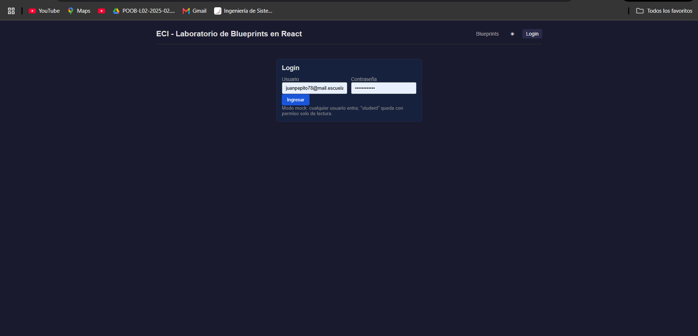
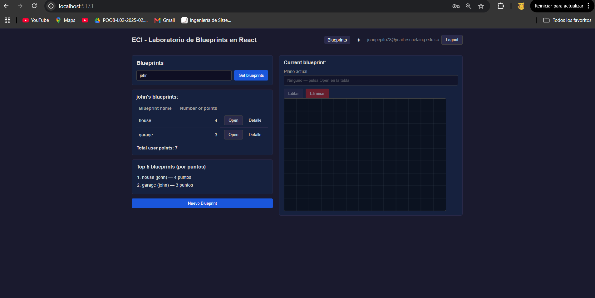
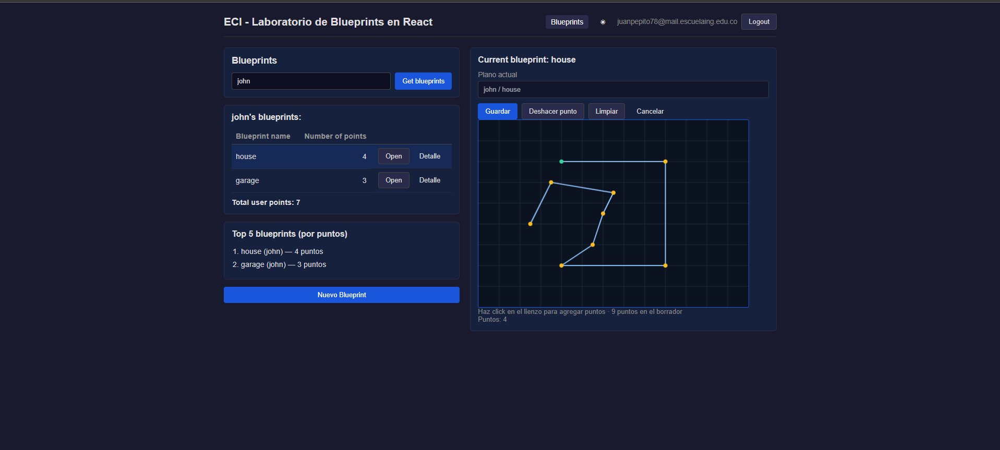
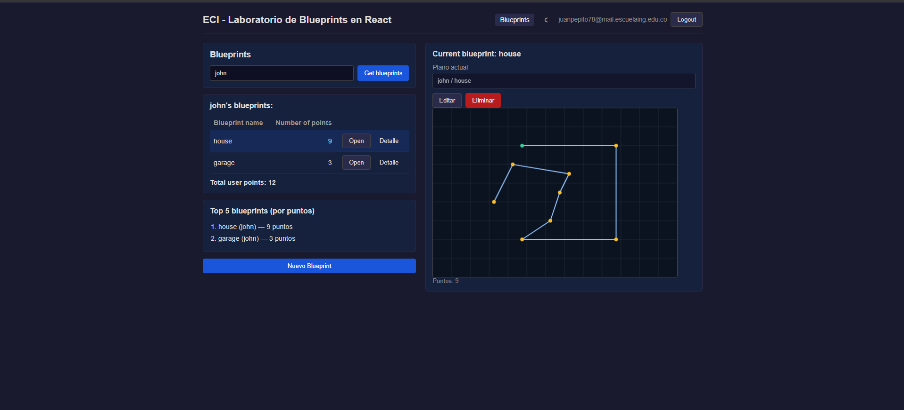
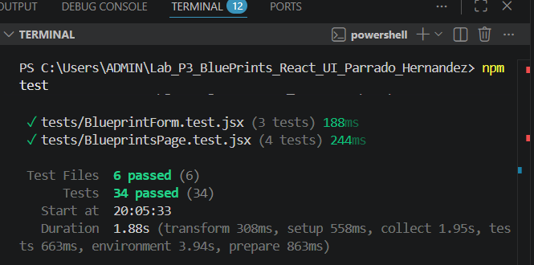

# Informe Lab P3 – React UI para Blueprints

**Integrantes:** Nicolás Parrado, Juan Esteban Hernández

---

## La aplicación en funcionamiento

### Login

Aquí se ve la pantalla de inicio de sesión. Como el proyecto está configurado en modo mock, no hace falta tener el backend corriendo: cualquier usuario y contraseña funcionan. Si se entra con el usuario `student`, la app queda en modo solo lectura y no deja crear ni editar planos.



---

### Lista de blueprints de un autor

Después de iniciar sesión, se puede buscar los planos de un autor escribiendo su nombre y haciendo clic en "Get blueprints". En este caso se buscó a `john` y aparecen sus dos planos (`house` y `garage`) con la cantidad de puntos de cada uno. Abajo de la tabla se muestra el total de puntos del autor.



---

### Canvas con un plano dibujado

Al hacer clic en "Open" en cualquier fila de la tabla, el plano se dibuja en el canvas de la derecha. Las líneas azules conectan los puntos en orden, el primer punto aparece en verde y los demás en amarillo. El campo "Plano actual" también se actualiza con el nombre del plano abierto.


---

### Modo edición

Con un plano abierto, al hacer clic en "Editar" el canvas se vuelve interactivo. Cada clic en el lienzo agrega un punto nuevo al borrador. Se puede deshacer el último punto, limpiar todo, o guardar los cambios con el botón "Guardar", que envía los puntos actualizados al servidor (o al mock).



---

### Dark mode y light mode

La app tiene soporte para modo oscuro y claro. Se cambia con el botón de la barra de navegación y la preferencia se guarda para la próxima vez que se abra.



---

### Pruebas pasando

Se corrieron las pruebas con `npm test`. Las 34 pruebas pasan sin errores.



---

## Qué se construyó

El laboratorio pedía modernizar el cliente clásico de Blueprints a una SPA en React. Partimos del cliente HTML/JS original y lo reescribimos usando React + Vite, Redux Toolkit para el estado global, Axios para las peticiones al backend y React Router para la navegación.

La app permite buscar los planos de un autor, abrirlos y verlos dibujados en un canvas, editarlos haciendo clic en el lienzo, crear planos nuevos y eliminarlos. Todo con autenticación JWT: si el token expira, la app redirige al login automáticamente.

---

## Cómo funciona por dentro

### Los dos modos: mock y backend real

Uno de los requerimientos era poder cambiar entre datos de prueba y el backend real con una sola línea. Eso se resuelve con la variable `VITE_USE_MOCK` en el archivo `.env`:

- Con `VITE_USE_MOCK=true` se usan datos en memoria, sin necesidad de tener el backend corriendo. Útil para desarrollar y para las pruebas.
- Con `VITE_USE_MOCK=false` se conecta al backend del Lab P2 en Spring Boot.

Ambos modos exponen exactamente la misma interfaz (`getByAuthor`, `create`, `update`, etc.), así que el resto de la app no sabe ni le importa cuál está usando.

### El estado global con Redux

Todo lo que la app necesita recordar vive en Redux: los planos cargados, el plano que está abierto ahora mismo, si hay algo cargando, si hubo un error. Así cualquier componente puede leer esa información sin tener que pasarla de padre a hijo por props.

Cuando se guarda o elimina un plano, el cambio se aplica de inmediato en la pantalla (optimistic update) y si el servidor responde con error, se revierte automáticamente y aparece un aviso.

### Seguridad con JWT

Al iniciar sesión se recibe un token JWT que se guarda y se adjunta automáticamente a cada petición al backend. Si el servidor responde con un 401 (sesión vencida), la app borra el token y manda al login con un aviso. Las rutas de creación y edición están protegidas: si el usuario no tiene el permiso de escritura, los botones aparecen deshabilitados.

### El canvas

El canvas dibuja los segmentos del plano ajustando la escala automáticamente para que siempre quepan todos los puntos. En modo edición, cada clic en el lienzo se convierte a coordenadas del plano y se agrega como punto nuevo. La escala se congela mientras se edita para que el dibujo no salte al agregar puntos.

---

## Pruebas

Se escribieron 34 pruebas con Vitest y Testing Library que cubren los componentes principales, el slice de Redux y los servicios. Para que el canvas funcione en el entorno de pruebas (que no tiene navegador real), se mockeó `getContext` en el archivo de setup.

También se probó la app manualmente en el navegador: login, búsqueda, abrir planos, editar, crear, eliminar, el rollback cuando falla una operación y la redirección al login cuando expira la sesión.

---

## Cambios al backend (Lab P2)

El backend original no tenía endpoints para actualizar ni eliminar planos completos, así que se agregaron `PUT /api/v1/blueprints/{author}/{name}` y `DELETE /api/v1/blueprints/{author}/{name}`. Ambos requieren el permiso de escritura y están cubiertos con pruebas en el backend también.

---

## Variables de entorno

El archivo `.env` en la raíz controla el comportamiento de la app:

- `VITE_USE_MOCK`: `true` para modo mock, `false` para backend real.
- `VITE_API_BASE_URL`: prefijo de los endpoints (`/api/v1`).
- `VITE_AUTH_URL`: endpoint de login (`/auth/login`).
- `VITE_BACKEND_URL`: URL del backend para el proxy de Vite (`http://localhost:8080`).
- `VITE_MOCK_WRITE_FAIL_RATE`: número entre 0 y 1 para simular fallos de escritura y ver el rollback en acción.

El archivo `.env.example` tiene los valores por defecto listos para copiar.

---

## CI con GitHub Actions

Cada push al repositorio dispara un workflow que corre el linter, las pruebas y el build de producción en ese orden. Si algo falla, el workflow queda en rojo.

---

## Cómo correr

```bash
npm install
npm run dev
```

Abre `http://localhost:5173`. Con `VITE_USE_MOCK=true` no hace falta el backend.

Para conectar al backend real: cambiar a `VITE_USE_MOCK=false` y tener el Lab P2 corriendo en el puerto 8080. Usuarios: `student / student123` (solo lectura) y `assistant / assistant123` (lectura y escritura).

```bash
npm test        # pruebas
npm run lint    # linter
npm run build   # build de producción
```
